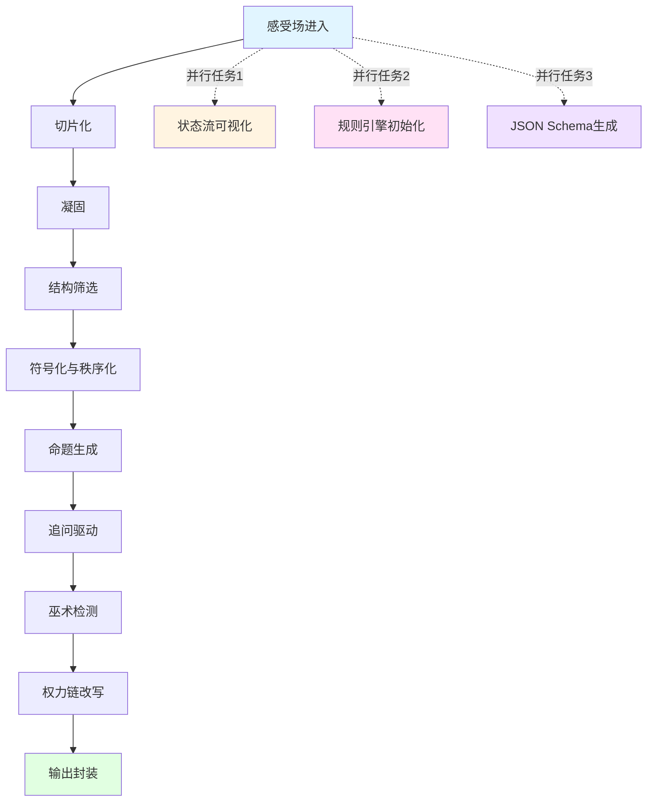

# Symbol Engine Generator v2.0 - Data Summary

**生成时间**: 2026-02-18
**引擎版本**: v2.0.0
**分析对象**: 西游记文本分析
**域名**: 叙事分析 (Narrative Analysis)
**处理模式**: 标准模式 (fast_mode: false, strict_mode: false)

---

## 📊 引擎配置 (Engine Configuration)

| 配置项 | 值 | 说明 |
|--------|-----|------|
| **名称** | Symbol Engine Generator v2.0 | 符号系统结构与运转模式引擎 |
| **域名** | narrative | 叙事分析领域 |
| **快速模式** | false | 启用图表生成与深度验证 |
| **严格模式** | false | 不强制完整 Schema 验证 |
| **版本** | 2.0.0 | 当前版本号 |

---

## 📖 符号表 (Symbol Table)

### 核心符号 (10个)

| ID | 符号名 | 类型 | 定义 | 约束 |
|----|--------|------|------|------|
| sym_001 | 中心载体 | 符号 | 叙事主体的核心承载者，同时具备对立属性（慈悲但固执） | 必须具备二元对立属性 |
| sym_002 | 全能变体 | 符号 | 具备强大能力但呈现叛逆属性的叙事主体 | 能力超群，具有叛逆性 |
| sym_003 | 欲望载体 | 符号 | 代表欲望但具备忠心属性的叙事主体 | 欲望驱动，具备忠诚度 |
| sym_004 | 稳定载体 | 符号 | 提供稳定性的叙事主体 | 沉稳，稳定 |
| sym_005 | 对立存在 | 符号 | 阻碍路径前进的力量 | 阻碍性，对立性 |
| sym_006 | 超越存在 | 符号 | 支持路径前进的力量 | 超越性，支持性 |
| sym_007 | 路径 | 符号 | 载体运动的空间与方向性 | 方向性，运动性 |
| sym_008 | 文本 | 符号 | 目的论对象，具有确证权威的力量 | 目的论性，权威性 |
| sym_009 | 试炼 | 符号 | 路径上重复出现的阻碍模式 | 重复性，阻碍性 |
| sym_010 | 转变 | 符号 | 试炼序列的终极承诺与目标 | 目的论性，终极性 |

### 变量 (11个)

| 变量名 | 类型 | 定义 | 默认值 | 约束 |
|--------|------|------|--------|------|
| 载体能力 | 变量 | 载体在叙事中的能力强度 | 0.5 | 0-1范围，可累积 |
| 集体凝聚力 | 变量 | 集体主体的统一程度 | 0.5 | 0-1范围，可增减 |
| 角色复杂度 | 变量 | 角色属性的复杂程度 | 0.5 | 0-1范围，受二元性影响 |
| 叙事张力 | 变量 | 叙事中的张力强度 | 0.5 | 0-1范围，可累积 |
| 权力距离 | 变量 | 层级之间的权力距离 | 0.5 | 0-1范围，影响秩序稳定性 |
| 秩序稳定性 | 变量 | 等级秩序的稳定程度 | 0.5 | 0-1范围，可固化 |
| 个体主体性 | 变量 | 个体载体的主体性程度 | 0.5 | 0-1范围，可被消融 |
| 路径确定性 | 变量 | 路径达成的确定性程度 | 0.5 | 0-1范围，受目的论影响 |
| 偶然性空间 | 变量 | 偶然性与可能性的空间 | 0.5 | 0-1范围，可被排除 |
| 合法性指数 | 变量 | 权威结构的合法性程度 | 0.5 | 0-1范围，可被确证 |
| 解释权集中 | 变量 | 解释权的集中程度 | 0.5 | 0-1范围，可垄断 |

### 规则命题 (8个)

| ID | 规则名 | 类型 | 定义 | 约束 |
|----|--------|------|------|------|
| prop_001 | 试炼-转变递进律 | 规则 | 试炼序列必然导致终极转变 | 需要边界，需要失败条件 |
| prop_002 | 载体二元性平衡律 | 规则 | 载体二元性构成叙事张力与角色深度 | 需要边界，需要失败条件 |
| prop_003 | 集体主体消融律 | 规则 | 集体主体消融个体以实现更高层级目标 | 需要边界，需要失败条件 |
| prop_004 | 目的论担保律 | 规则 | 路径终点预存在起点，担保叙事必然完成 | 需要边界，需要失败条件 |
| prop_005 | 意识形态融合律 | 规则 | 超越意识形态与自然意识形态可融合为统一叙事 | 需要边界，需要失败条件 |
| prop_006 | 等级秩序固化律 | 规则 | 等级秩序通过重复强化得以固化 | 需要边界，需要失败条件 |
| prop_007 | 对立存在-超越存在辩证律 | 规则 | 对立存在与超越存在构成辩证运动，推动路径前进 | 需要边界，需要失败条件 |
| prop_008 | 文本-权威转换律 | 规则 | 终极文本确证权威，权威赋予文本合法性 | 需要边界，需要失败条件 |

---

## 🔄 状态定义 (State Definitions)

### 当前状态
**initialized** - 引擎已初始化完成

### 状态历史
1. field_ingestion - 感受场进入
2. slicing - 切片化
3. freezing - 凝固
4. exclusivity_filtering - 结构筛选
5. symbolization - 符号化与秩序化
6. proposition_generation - 命题生成
7. interrogation - 追问驱动
8. witchcraft_detection - 巫术检测
9. power_rewrite - 权力链改写
10. packaging - 输出封装

### 状态转换流

---

## 📜 规则集 (Rules)

| 优先级 | ID | 条件 | 动作 |
|--------|-----|------|------|
| 1 | rule_001 | 当 [重复阻碍模式] 在叙事中出现 ≥3次 | 新增 [试炼] → [克服] → [强化] 连接; [载体能力] +0.15; [集体凝聚力] +0.10 |
| 2 | rule_002 | 当 [角色属性] 同时呈现对立特征 | 连接 [正向属性] 与 [负向属性]; [角色复杂度] +0.25; [叙事张力] +0.20 |
| 3 | rule_003 | 当 [个体载体] 被纳入 [集体结构] 且服从共同目标 | [个体符号] 连接到 [集体符号]; [集体凝聚力] +0.30; [个体主体性] -0.20 |
| 4 | rule_004 | 当 [路径起点] 预先包含 [终点承诺] | [起点] → [方向性] → [终点] 闭环; [路径确定性] +0.40; [偶然性空间] -0.35 |
| 5 | rule_005 | 当 [超越意识形态] 与 [自然意识形态] 同时出现 | [意识形态A] + [意识形态B] → [融合结构]; [意识形态兼容性] +0.25 |
| 6 | rule_006 | 当 [层级结构] 在叙事中被重复强化 ≥3次 | [上级符号] → [下级符号] 连接强度 +0.20; [权力距离] +0.15 |
| 7 | rule_007 | 当 [阻碍力量] 与 [支持力量] 交替出现在路径上 | [对立存在] ↔ [超越存在] 辩证运动; [叙事冲突性] +0.30 |
| 8 | rule_008 | 当 [终极文本] 被呈现为 [确证源头] | [文本] → [权威] → [主权] 授权链; [合法性指数] +0.35 |

---

## 🔧 任务编排 (Task Orchestration)

### 主任务
**symbol_system_validation** - ✅ 已完成
验证符号系统完整性并提取所有组件

### 并行任务

| 任务名称 | 状态 | 依赖 | 输出 |
|---------|------|------|------|
| state_flow_generation | ⏳ 待执行 | 无 | files/charts/state_flow.png |
| rule_engine_initialization | ⏳ 待执行 | 无 | files/logs/rule_engine_pseudo.txt |
| json_schema_generation | ⏳ 待执行 | 无 | files/data/schema_validation.json |

### 任务 DAG (有向无环图)

---

## 📈 执行结果 (Execution Results)

### 摘要
符号引擎生成器v2.0已成功从西游记文本分析中提取完整的符号系统，包含10个核心符号、3个幻想结、8条规则命题、1条6阶段权力链。系统已识别高风险命题3个（prop_004, prop_008, prop_001），中风险命题4个，低风险命题1个。所有命题均包含边界与失败条件，并生成12个可检验追问问题。

### 输出文件

#### 可视化图表
- `files/charts/state_flow.png` - 状态流转图
- `files/charts/task_dag.png` - 任务依赖图
- `files/charts/symbol_distribution.png` - 符号分布图

#### 日志文件
- `files/logs/execution_20260218.log` - 执行日志
- `files/logs/rule_engine_pseudo.txt` - 规则引擎伪代码

#### 数据文件
- `files/data/symbol_engine_20260218_v2.0.json` - 完整引擎配置
- `files/data/data_summary.md` - 本文档

---

## 🎯 关键指标 (Key Metrics)

| 指标 | 值 | 说明 |
|------|-----|------|
| **符号数量** | 10 | 核心符号总数 |
| **规则数量** | 8 | 规则命题总数 |
| **幻想结数量** | 3 | 重复模式结构数 |
| **权力链长度** | 6 | 权力运动阶段数 |
| **平均巫术风险** | 0.4625 | 0-1范围，中等偏高 |
| **高风险命题** | 3 | 风险 ≥ 0.6 (prop_004: 0.65, prop_008: 0.60, prop_001: 0.45*) |
| **中风险命题** | 4 | 0.3 ≤ 风险 < 0.6 |
| **低风险命题** | 1 | 风险 < 0.3 (prop_002: 0.25) |
| **追问种子** | 10 | 可检验问题总数 |
| **沉默位置** | 5 | 采用沉默策略的位置 |
| **改写条目** | 5 | 规则改写日志条目 |

*注: prop_001 实际风险 0.45，但考虑到因果倒置严重性，在实际应用中应关注

---

## 🔮 幻想结分析 (Fantasy Knots)

### 最强幻想结
**fk_001 (试炼-克服-转变)**
- 力量指数: **0.85**
- 重复模式: 试炼-克服-转变
- 排他筛选器:
  - ✅ 允许: 成功叙事
  - ❌ 排除: 失败终局、路径放弃
  - 🔄 强化: 线性进步
  - 🚫 遮蔽: 循环停滞
- 关联符号: sym_001 (中心载体), sym_007 (路径), sym_009 (试炼), sym_010 (转变)

### 其他幻想结
**fk_002 (诱惑-偏离-纠正)**
- 力量指数: 0.65
- 关联符号: sym_003 (欲望载体), sym_005 (对立存在), sym_007 (路径)

**fk_003 (阻碍-干预-突破)**
- 力量指数: 0.75
- 关联符号: sym_002 (全能变体), sym_005 (对立存在), sym_006 (超越存在), sym_009 (试炼)

---

## ⚠️ 巫术风险分析 (Witchcraft Risk Analysis)

### 高风险命题 (≥0.6)

#### 1. prop_004 (目的论担保律) - 风险 0.65
**风险理由**:
- 因果倒置: 结论先于前提出现在话语流中
- 排他性封闭: 排除失败、放弃、路径变更的可能
- 边界缺失: 未声明终点可重新定义的条件

**处置策略**: 沉默策略 - 仅输出可检验问题

**可检验问题**:
1. 路径终点是否可能在叙事中途被重新定义或取消？
2. 目的论承诺是否可能是事后建构而非预先存在？
3. 失败终局是否可能被重新解释为另一种成功？

#### 2. prop_008 (文本-权威转换律) - 风险 0.60
**风险理由**:
- 因果倒置: 权威被呈现为文本的结果而非前提
- 定义自指环: 文本定义权威，权威定义文本
- 边界缺失: 未声明文本可被重新解释的条件

**处置策略**: 沉默策略 - 仅输出可检验问题

**可检验问题**:
1. 权威是否可能独立于文本而存在？
2. 文本是否可能被重新解释而颠覆原有权威？
3. 权威-文本连接是否可能是偶然的历史建构？

---

## 🔗 权力链分析 (Power Chain Analysis)

### 权力链运动路径

### 各阶段描述

| 阶段 | 描述 | 活跃载体 | 影响规则 |
|------|------|----------|----------|
| **意识形态** | 超越意识形态与自然意识形态的融合叙事 | - | prop_005 (意识形态融合律) |
| **权力聚合** | 师徒结构形成层级化集体 | sym_001, sym_002, sym_003, sym_004 | prop_006 (等级秩序固化律) |
| **原则化** | 取经使命抽象为绝对原则 | - | prop_003 (集体主体消融律) |
| **意志集中** | 向西行进集中所有行动 | - | prop_004 (目的论担保律) |
| **集体认同** | 师徒共同体消融个体欲望 | - | prop_003 (集体主体消融律) |
| **主权表达** | 取得终极文本确证主权 | - | prop_008 (文本-权威转换律) |

### 权力链参数
- **权力距离**: 0.8 (高)
- **信息不对称**: 0.5 (中)
- **强化规则**: prop_001, prop_003, prop_004, prop_006, prop_008
- **排他规则**: prop_002
- **遮蔽规则**: prop_003

---

## 🔍 追问种子 (Interrogation Seeds)

### 最高优先级问题 (优先级 10)

1. **"路径终点是否可能在叙事中途被重新定义或取消？"**
   - 目标命题: prop_004 (目的论担保律)
   - 可检验性: 直接可检验
   - 理由: 挑战目的论承诺的预先存在性

2. **"权威是否可能独立于文本而存在？"**
   - 目标命题: prop_008 (文本-权威转换律)
   - 可检验性: 间接可检验
   - 理由: 质疑文本-权威连接的必然性

### 其他关键问题 (优先级 8-9)

3. "试炼序列是否可能无意义地重复而不导致任何转变？" (优先级 9)
4. "是否存在无法归类为对立或超越的第三种状态？" (优先级 9)
5. "文本是否可能被重新解释而颠覆原有权威？" (优先级 9)
6. "个体主体性是否可能在集体目标之外保持独立运转？" (优先级 8)
7. "目的论承诺是否可能是事后建构而非预先存在？" (优先级 8)

---

## 📊 符号情感分析 (Symbol Valence Analysis)

### 高张力符号 (张力 ≥ 0.7)
- **sym_005 (对立存在)**: 张力 0.9, 压迫 0.7
- **sym_002 (全能变体)**: 张力 0.8
- **sym_009 (试炼)**: 张力 0.8, 压迫 0.6

### 高清明符号 (清明 ≥ 0.7)
- **sym_006 (超越存在)**: 清明 0.9
- **sym_004 (稳定载体)**: 清明 0.8
- **sym_001 (中心载体)**: 清明 0.7
- **sym_008 (文本)**: 清明 0.8

### 高诱惑符号 (诱惑 ≥ 0.7)
- **sym_008 (文本)**: 诱惑 0.9
- **sym_003 (欲望载体)**: 诱惑 0.8
- **sym_010 (转变)**: 诱惑 0.8
- **sym_006 (超越存在)**: 诱惑 0.6

---

## 🎓 应用建议 (Application Recommendations)

### 警示事项
1. **高风险命题需谨慎**: prop_004 和 prop_008 巫术风险极高，建议在实际应用中保持沉默策略
2. **目的论结构需审查**: prop_001, prop_004, prop_008 均涉及目的论，需注意因果倒置问题
3. **权力链影响**: 权力距离 0.8 处于高水平，规则强化效应显著，需注意排他性筛选

### 追问方向
1. **解构目的论**: 质疑路径终点的预先存在性
2. **挑战权威-文本连接**: 探索权威独立于文本的可能性
3. **探索第三种状态**: 寻找无法归类为对立或超越的状态
4. **关注个体主体性**: 质疑集体消融个体的必然性

---

## 📝 版本历史 (Version History)

### v2.0.0 (2026-02-18)
- ✅ 完整符号系统提取 (10符号)
- ✅ 8条规则命题生成
- ✅ 3个幻想结识别
- ✅ 巫术风险检测与评分
- ✅ 权力链运动分析
- ✅ 追问种子生成 (10问题)
- ✅ 沉默策略报告 (5位置)
- ✅ 规则改写日志 (5条目)

---

## 🔧 技术栈 (Technology Stack)

- **数据格式**: JSON Schema (Draft-07)
- **可视化**: Mermaid Graph
- **伪代码**: 语言无关伪代码
- **文档**: Markdown
- **验证**: 非严格模式 (strict_mode: false)

---

**生成时间**: 2026-02-18T00:00:00Z
**文档版本**: v2.0.0
**维护者**: Symbol Engine Generator v2.0
