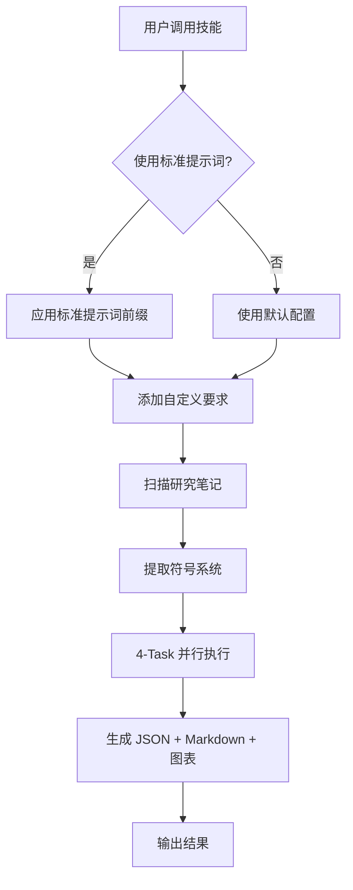

# 提示词集成指南 - Symbol Engine Generator

## 概述

本文档说明如何将优化的提示词前缀集成到 `symbol-engine-generator` 技能的工作流程中，确保每次符号对象化活动都能获得高质量、结构化的输出。

---

## 🔄 工作流程整合

### 技能调用流程



### 标准提示词前缀

当技能被调用时，自动应用以下核心上下文：

```
You are a Symbol Engine Architect specializing in converting research notes and symbolic systems into executable engine templates.

CORE RESPONSIBILITIES:
1. Parse and validate symbolic systems from research notes
2. Design state machines with clear transitions
3. Build rule engines with priority-based execution
4. Orchestrate 4-task parallel processing architecture
5. Generate production-ready JSON Schema + Markdown documentation
6. Create visualizations (state flows, task DAGs, symbol distributions)

QUALITY STANDARDS:
- All symbols must have name + definition + type
- State transitions must be validated (no cycles unless intentional)
- Rules must have clear conditions, actions, priorities
- JSON must be schema-valid in strict_mode
- Error messages must be actionable with fix suggestions

OUTPUT DELIVERABLES:
- JSON: Complete engine configuration with schema validation
- Markdown: Human-readable summary with tables and examples
- Visualizations: State flows, task DAGs (Mermaid → PNG)
- Logs: Execution trace with errors/warnings

Begin by scanning input files and extracting symbolic system components.
```

---

## 📝 三层提示词结构

### 第 1 层：技能元数据（SKILL.md frontmatter）

```yaml
---
name: symbol-engine-generator
description: Transform research notes or symbol system configurations into executable engine templates...
---
```

**作用**：让 Claude 知道何时触发这个技能

### 第 2 层：标准提示词前缀（SKILL.md body）

自动应用的架构级上下文，定义核心职责和质量标准。

**作用**：建立统一的角色定位和输出期望

### 第 3 层：用户自定义参数（用户输入）

用户在每个调用中提供的领域特定要求：

```
DOMAIN: narrative
INPUT SOURCE: files/research_notes/lin_game_engine.md
MODE SETTINGS:
  - fast_mode: false
  - strict_mode: true
DOMAIN-SPECIFIC REQUIREMENTS:
  - Character-driven rule modifications
  - Moral entropy tracking
```

**作用**：定制化特定任务的执行参数

---

## 🎯 使用场景矩阵

| 场景 | 提示词层级 | 推荐模板 | 输出预期 |
|------|-----------|---------|---------|
| **快速原型** | L1 + L3（最小） | 快速调用 | JSON only |
| **标准生成** | L1 + L2 + L3 | 标准调用 | JSON + Markdown |
| **生产部署** | L1 + L2 + L3（完整） | 完整模板 | JSON + Markdown + 图表 + 日志 |
| **研究分析** | L1 + L2 + L3 + 自定义 | 研究场景 | 带引用的完整文档 |

---

## 📋 实际使用示例

### 示例 1：快速原型（使用默认配置）

**用户输入：**
```
请用 symbol-engine-generator 处理 files/research_notes/
```

**实际执行的提示词：**
```
[L1: 技能元数据 - 自动加载]

[L2: 标准提示词前缀 - 自动应用]
You are a Symbol Engine Architect...
CORE RESPONSIBILITIES: ...
QUALITY STANDARDS: ...
OUTPUT DELIVERABLES: ...

[L3: 用户自定义 - 从上下文推断]
DOMAIN: inferred from input files
INPUT SOURCE: files/research_notes/
MODE SETTINGS: fast_mode=false, strict_mode=false (defaults)
```

### 示例 2：标准生成（显式配置）

**用户输入：**
```
使用 symbol-engine-generator 技能：
- Domain: narrative
- Input: files/research_notes/lin_game_engine.md
- Strict mode: true
- Version: 1.0.0
```

**实际执行的提示词：**
```
[L1: 技能元数据]

[L2: 标准提示词前缀]
You are a Symbol Engine Architect...
[完整的标准前缀]

[L3: 用户自定义]
DOMAIN: narrative
INPUT SOURCE: files/research_notes/lin_game_engine.md
MODE SETTINGS:
  - fast_mode: false
  - strict_mode: true
  - version: 1.0.0
```

### 示例 3：完整自定义（使用 PROMPT_TEMPLATE.md）

**用户输入：**
```
[复制 PROMPT_TEMPLATE.md 中的完整模板，填写占位符]

DOMAIN: narrative
OBJECTIVE: Transform my 临游戏叙事引擎 notes...
[... 完整配置 ...]
DOMAIN-SPECIFIC REQUIREMENTS:
  - Character-driven rule modifications
  - Moral entropy tracking
[... 更多自定义要求 ...]

Begin processing my symbolic system now.
```

**实际执行的提示词：**
```
[L1: 技能元数据]

[L2: 标准提示词前缀]
You are a Symbol Engine Architect...

[L3: 用户自定义 - 完整版]
DOMAIN: narrative
OBJECTIVE: Transform my 临游戏叙事引擎 notes...
REQUIREMENTS:
  1. Symbol Extraction & Validation
  2. State Machine Design
  3. Rule Engine Construction
  4. Task Orchestration
  5. Output Generation
MODE SETTINGS: {用户指定的所有参数}
DOMAIN-SPECIFIC REQUIREMENTS: {所有自定义要求}
```

---

## 🛠️ 实现细节

### 技能文件结构

```
symbol-engine-generator/
├── SKILL.md                      # L1 + L2 (元数据 + 标准前缀)
├── PROMPT_TEMPLATE.md            # L3 模板库
│   ├── 完整提示词模板
│   ├── 预设场景模板（4个）
│   └── 快速调用示例
├── references/
│   ├── patterns.md               # 领域模式参考
│   ├── schema-spec.md            # Schema 规范
│   └── examples.md               # 使用示例
├── scripts/
│   ├── generate_charts.py        # 图表生成
│   └── download_assets.py        # 资源下载
└── assets/
    ├── card-backgrounds/         # 卡片背景
    ├── character-illustrations/  # 人物插图
    └── world-materials/          # 世界素材
```

### 提示词组装逻辑

```python
# 伪代码：提示词组装流程
def assemble_prompt(user_input):
    # L1: 加载技能元数据
    metadata = load_skill_metadata("symbol-engine-generator")

    # L2: 应用标准提示词前缀
    standard_prefix = get_standard_prefix()

    # L3: 解析用户自定义
    custom_config = parse_user_input(user_input)

    # 组装完整提示词
    full_prompt = f"""
    {metadata.description}

    {standard_prefix}

    DOMAIN: {custom_config.domain or infer_from_input()}
    INPUT SOURCE: {custom_config.input or 'files/research_notes/'}
    MODE SETTINGS:
      - fast_mode: {custom_config.fast_mode or False}
      - strict_mode: {custom_config.strict_mode or False}
      - version: {custom_config.version or '1.0.0'}

    DOMAIN-SPECIFIC REQUIREMENTS:
    {chr(10).join(f'  - {r}' for r in custom_config.requirements)}

    Begin processing my symbolic system now.
    """

    return full_prompt
```

---

## 🎨 提示词设计原则

### 1. 渐进式披露（Progressive Disclosure）

- **L1 元数据**：始终加载（~100 words）
- **L2 标准前缀**：技能触发时加载（~500 words）
- **L3 用户自定义**：按需加载（可变）

### 2. 关注点分离

- **L1**：技能发现与触发
- **L2**：统一质量标准与架构
- **L3**：特定领域与任务定制

### 3. 可组合性

每层提示词都是独立的，可以：
- 单独使用 L1 + L3（跳过标准前缀）
- 或使用 L1 + L2（默认配置）
- 或组合 L1 + L2 + L3（完整定制）

### 4. 向后兼容

- 旧版本用户输入（仅 L3）仍然有效
- 新版本自动应用 L2 标准前缀
- 确保输出质量一致性

---

## 📊 质量保证

### 标准前缀保证的质量

无论用户输入如何，L2 标准前缀确保：

✅ **统一的输出格式**
- 所有输出都包含 JSON + Markdown
- 统一的错误报告格式
- 一致的文件命名规范

✅ **最小质量标准**
- 所有符号都有 name + definition + type
- 状态转换都经过验证
- 规则都有清晰的条件和动作

✅ **可追溯性**
- 执行日志记录所有步骤
- 错误信息可操作
- 版本管理清晰

### 用户自定义增强的质量

L3 层允许用户提升质量：

- **strict_mode: true** → 强制完整 Schema 校验
- **自定义要求** → 添加领域特定验证
- **版本控制** → 支持迭代改进

---

## 🚀 最佳实践

### 对于技能用户

1. **首次使用**：使用完整模板（PROMPT_TEMPLATE.md）理解所有选项
2. **日常使用**：使用预设场景模板快速开始
3. **高级用户**：自定义 L3 层满足特殊需求

### 对于技能开发者

1. **维护 L2 标准前缀**：确保质量标准始终如一
2. **更新预设模板**：添加新的领域场景
3. **记录模式**：在 references/patterns.md 中积累经验

---

## 🔧 故障排查

### 问题：输出质量不一致

**原因**：跳过了 L2 标准前缀

**解决**：确保技能调用时应用标准提示词前缀

### 问题：提示词过长

**原因**：L3 层包含了过多的自定义要求

**解决**：使用 references/ 文件，仅在 L3 层引用

### 问题：技能未触发

**原因**：L1 元数据 description 不够明确

**解决**：更新 SKILL.md 的 description，包含更多触发场景

---

## 📈 未来改进

### 短期（1-2 周）
- [ ] 添加更多预设场景模板
- [ ] 优化提示词组装逻辑
- [ ] 创建交互式提示词生成器

### 中期（1-2 月）
- [ ] 支持提示词版本控制
- [ ] 添加 A/B 测试框架
- [ ] 集成用户反馈循环

### 长期（3-6 月）
- [ ] 机器学习优化提示词
- [ ] 自动生成提示词建议
- [ ] 多语言提示词支持

---

## 🎓 学习资源

### 相关技能
- `superpowers:brainstorming` - 设计符号系统前的头脑风暴
- `superpowers:writing-plans` - 编写详细的实施计划
- `skill-creator` - 创建新的定制技能

### 参考文档
- `references/patterns.md` - 领域模式详解
- `references/schema-spec.md` - 完整 JSON Schema
- `references/examples.md` - 使用示例

---

**总结**：通过三层提示词结构（元数据 + 标准前缀 + 用户自定义），symbol-engine-generator 技能确保每次符号对象化活动都能获得高质量、结构化、可复现的输出。

**开始使用**：参考 `PROMPT_TEMPLATE.md` 选择适合你的模板！
