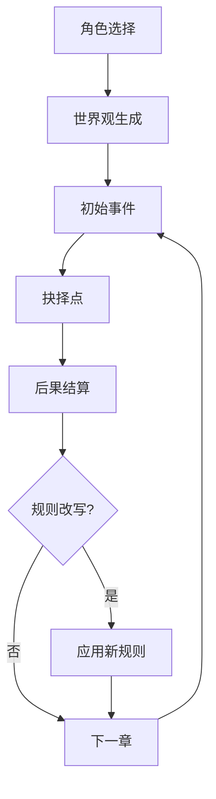

# Quick Start: Using Symbol Engine Generator

## 🎯 核心价值

将你已有的 **"临游戏叙事引擎"** 研究笔记转换为可执行的引擎模板！

## 📂 你的现有文件

你已经有了完整的符号系统定义：

```
files/
├── 04_规则卡示例x12.md          # ✅ 规则定义
├── 02_角色卡示例x8.md            # ✅ 角色符号
├── 03_世界观骨架模板与示例.md    # ✅ 世界观状态
├── 05_叙事章节Demo与动态改写算法.md  # ✅ 状态流转
└── ...
```

## 🚀 三步生成引擎

### Step 1: 创建研究笔记目录

```bash
mkdir -p files/research_notes
```

### Step 2: 整合现有文件（可选）

你的文件已经是很好的研究笔记了！可以直接使用，或者创建一个整合文件：

```bash
# 创建整合笔记
cat > files/research_notes/lin_game_engine.md << 'EOF'
# 临游戏叙事引擎 - 符号系统

## 规则表 (来源: 04_规则卡示例x12.md)
- 信誉契约: 社会秩序类，触发承诺 → 资源×2，违约代价×3
- 信息不对称: 现实映射类，信息优势 → 交易优化20-40%
- 权力距离: 现实映射类，权力距离>7 → 对话选项-50%
- 时间债务: 风险管理类，每个选择消耗时间
- 道德熵: 风险管理类，灰色选择 → 道德熵+5，>50崩溃
- 承诺悖论: 剧情推进类，信息掮客承诺 → 效果/代价翻倍
- 玩笑改写: 反制机制类，混沌小丑 → 规则变荒诞版本

## 角色符号 (来源: 02_角色卡示例x8.md)
- 信息掮客: 性格{机会主义,不可知论者}, 动机{建立信息网络}
- 权力边缘人: 性格{权威服从,权力渴望}, 禁忌{不能公开挑战}
- 道德狂热者: 性格{二元对立,绝对正义}, 禁忌{不能妥协}
- 时间债务人: 特殊机制，每个选择消耗剩余时间
- 混沌小丑: 性格{荒诞主义}, 能力{改写规则为荒诞版}

## 状态流转 (来源: 05_叙事章节Demo)
角色选择 → 世界观生成 → 初始事件 → 抉择点 → 后果结算 → 下一章
                                                    ↓
                                              规则可能改写

## 规则改写触发条件
1. 角色偏置触发（如信息掮客触发承诺悖论）
2. 现实事件注入（如新法规出台）
3. 玩家主动宣言（挑战规则）
4. 规则污染度累积（污染度>5开始随机变异）
EOF
```

### Step 3: 调用技能生成引擎

在对话中告诉 Claude：

```
请使用 symbol-engine-generator 技能，
处理我的研究笔记 files/research_notes/lin_game_engine.md
```

## 📊 生成结果

### JSON 配置文件

```json
{
  "engine_config": {
    "name": "lin_narrative_engine",
    "domain": "narrative",
    "version": "1.0.0"
  },
  "symbol_table": {
    "symbols": [
      {
        "name": "信誉度",
        "type": "状态变量",
        "definition": "角色社会信用，范围0-100",
        "default": 50
      },
      {
        "name": "道德熵",
        "type": "隐藏变量",
        "definition": "道德沦丧程度，>50触发崩溃",
        "default": 0
      }
    ]
  },
  "state": {
    "current": "角色选择",
    "transitions": [
      {"from": "角色选择", "to": "世界观生成", "trigger": "player_select_character"},
      {"from": "世界观生成", "to": "初始事件", "trigger": "world_ready"},
      {"from": "初始事件", "to": "抉择点", "trigger": "encounter_event"}
    ]
  },
  "rules": [
    {
      "id": "rule_credit_contract",
      "condition": "player_make_promise() == true",
      "action": "multiply_resource(2) AND lock_reputation()",
      "priority": 10
    },
    {
      "id": "rule_moral_entropy",
      "condition": "moral_choice_made() == true",
      "action": "moral_entropy += 5",
      "priority": 5
    }
  ]
}
```

### 状态流转图

自动生成 Mermaid 图表：



### Markdown 文档

可读的引擎配置说明：

```markdown
# 临游戏叙事引擎 v1.0

## 符号表 (7个核心符号)

| 符号名 | 类型 | 定义 | 默认值 |
|--------|------|------|--------|
| 信誉度 | 状态变量 | 社会信用分数 | 50 |
| 道德熵 | 隐藏变量 | 道德沦丧程度 | 0 |
| ... | ... | ... | ... |

## 规则系统 (12条规则)

### 社会秩序类
1. **信誉契约** - 当做出承诺时，资源×2，违约代价×3

### 反制机制类
2. **玩笑改写** - 混沌小丑可将规则改为荒诞版本

## 使用方法
...
```

## 🎨 可视化资源

技能已包含占位符素材，可以从 Pinterest 下载替换：

### 卡片背景
```
skills/symbol-engine-generator/assets/card-backgrounds/
├── placeholder_001.svg  # 可替换为 Pinterest 塔罗牌风格背景
├── placeholder_002.svg
└── README.md            # 包含下载链接
```

### 人物插图
```
skills/symbol-engine-generator/assets/character-illustrations/
├── placeholder_001.svg  # 可替换为角色插画
└── README.md            # 包含人物插图搜索链接
```

### 世界素材
```
skills/symbol-engine-generator/assets/world-materials/
├── placeholder_001.svg  # 可替换为废土风格素材
└── README.md            # 包含世界观素材搜索链接
```

## 🔧 高级用法

### 1. 快速原型（fast_mode）

```
请使用 symbol-engine-generator 技能，
fast_mode: true，处理我的笔记
```

→ 跳过图表生成，仅输出核心配置

### 2. 严格验证（strict_mode）

```
请使用 symbol-engine-generator 技能，
strict_mode: true，验证我的符号系统
```

→ 强制完整 Schema 校验，报告所有缺失字段

### 3. 组合多个引擎

```
请分别生成叙事引擎和决策系统，
然后合并它们的符号表
```

→ 生成组合引擎，跨领域共享符号

## 📝 输出文件位置

```
files/
├── data/
│   ├── lin_narrative_engine_20260217_v1.0.json  # 引擎配置
│   └── data_summary.md                          # 可读摘要
└── charts/
    ├── state_flow.png                           # 状态流转图
    ├── task_dag.png                             # 任务 DAG
    └── symbol_distribution.png                  # 符号分布图
```

## 🎯 下一步

1. **测试引擎** - 用生成的配置运行模拟
2. **调整规则** - 根据测试结果修改笔记，重新生成
3. **添加资源** - 从 Pinterest 下载素材，替换占位符
4. **版本管理** - 每次修改生成新版本（v1.0, v1.1, ...）

## 💡 示例对话

```
你: 请用 symbol-engine-generator 处理我的临游戏叙事引擎笔记

Claude: 使用 symbol-engine-generator 技能处理符号系统...

✓ 已读取文件: files/research_notes/lin_game_engine.md
✓ 提取符号: 7个（信誉度、道德熵、信息不对称...）
✓ 提取状态: 6个状态，5个转换
✓ 提取规则: 12条规则

正在生成:
  ✓ JSON Schema: files/data/lin_narrative_engine_v1.0.json
  ✓ 状态流转图: files/charts/state_flow.png
  ✓ 任务 DAG: files/charts/task_dag.png

完成！引擎模板已生成，包含:
- 7个符号变量
- 12条游戏规则
- 完整状态流转系统
- 动态规则改写机制

查看详情: files/data/data_summary.md
```

## 🆘 常见问题

**Q: 我的笔记格式不对怎么办？**
A: 技能会自动识别常见模式。如果识别失败，使用上述整合模板。

**Q: 想添加新规则怎么办？**
A: 直接修改笔记文件，重新运行技能即可生成新版本。

**Q: 如何替换占位符素材？**
A: 查看 assets/*/README.md 中的 Pinterest 链接，手动下载后替换同名文件。

**Q: 能生成代码吗？**
A: 可以！设置 domain: "code"，技能会生成代码模板。

---

**准备好开始了吗？直接说：**

```
请用 symbol-engine-generator 处理我的临游戏引擎笔记
```
