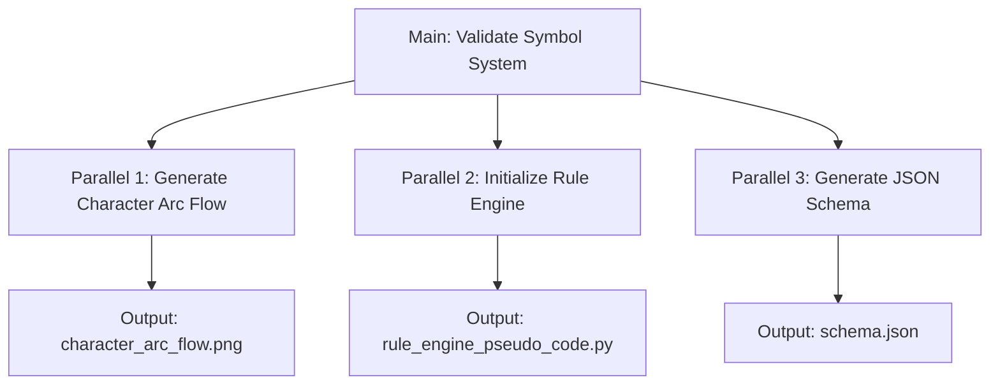
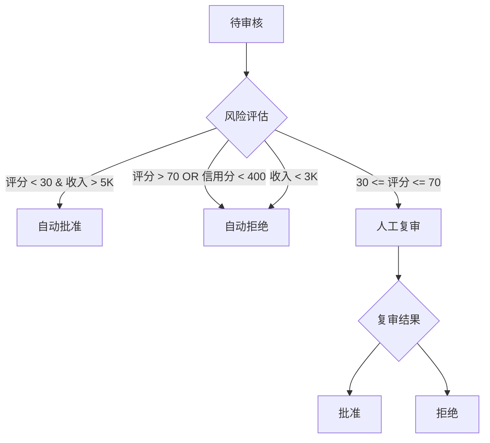

# Example Workflows and Use Cases

## Example 1: Research Notes → Engine Template

### Input (`files/research_notes/climate_model.md`)

```markdown
# Research: Climate Change Model

## Symbol Table
- **温度**: 连续变量，单位摄氏度，范围 [-50, 50]
- **CO2浓度**: 状态变量，阈值 400ppm
- **冰川覆盖**: 状态变量，范围 [0, 100]%

## State Transitions
正常 → 升温中 → 危机 → 恢复

## Rules
1. 当 CO2 > 400 → 触发 "升温中" 状态
2. 当 冰川覆盖 < 30% → 触发 "危机" 状态
```

### Execution Steps

```python
# 1. Scan and Parse
symbols = extract_symbols(note)
# → [{name: "温度", type: "连续变量", ...}, ...]

states = extract_states(note)
# → {current: "正常", transitions: [{"正常": "升温中", trigger: "CO2 > 400"}]}

rules = extract_rules(note)
# → [{id: "rule_001", condition: "CO2 > 400", action: "trigger('升温中')"}]
```

### Output JSON

```json
{
  "engine_config": {
    "name": "climate_model",
    "domain": "research",
    "version": "1.0.0"
  },
  "symbol_table": {
    "symbols": [
      {
        "name": "温度",
        "type": "连续变量",
        "definition": "摄氏度温度值",
        "default": 0,
        "constraints": ["min: -50", "max: 50"]
      }
    ]
  },
  "state": {
    "current": "正常",
    "transitions": [
      {"from": "正常", "to": "升温中", "trigger": "CO2 > 400"}
    ]
  },
  "rules": [
    {"id": "rule_001", "condition": "CO2 > 400", "action": "trigger('升温中')", "priority": 0}
  ]
}
```

### Output Visualization

**Mermaid State Flow**:


---

## Example 2: Narrative Game Engine

### Input (`files/research_notes/narrative_system.md`)

```markdown
# Symbol System: 临游戏叙事引擎

## 角色卡示例
- **信息掮客**: 性格{不可知论者,机会主义}, 动机{建立独立信息网络}
- **权力边缘人**: 性格{权威服从,权力渴望}, 禁忌{不能公开挑战秩序}

## State Flow
角色选择 → 世界观生成 → 初始事件 → 抉择点 → 后果结算 → 下一章

## Rules
1. 当 "角色 == 信息掮客" && "做出承诺" → 触发 "承诺悖论"
2. 当 "道德熵 > 50" → 角色崩溃，失去所有盟友
```

### 4-Task Execution



### Output

```json
{
  "engine_config": {
    "name": "narrative_engine",
    "domain": "narrative"
  },
  "symbol_table": {
    "symbols": [
      {
        "name": "character_type",
        "type": "状态变量",
        "definition": "玩家选择的角色类型",
        "default": null,
        "constraints": ["enum: 信息掮客,权力边缘人,道德狂热者,..."]
      }
    ]
  },
  "rules": [
    {
      "id": "narrative_rule_001",
      "condition": "character_type == '信息掮客' AND action == 'make_promise'",
      "action": "activate('承诺悖论')",
      "priority": 10
    }
  ]
}
```

---

## Example 3: Decision System with Complex Rules

### Input

```markdown
## Loan Approval System

### Symbols
- 风险评分: 0-100
- 收入: 月收入（元）
- 信用分: 300-850

### States
待审核 → 风险评估 → 人工复审 → 批准/拒绝

### Rules
1. IF 风险评分 < 30 AND 收入 > 5000 → 自动批准
2. IF 风险评分 > 70 OR 信用分 < 400 → 自动拒绝
3. IF 30 <= 风险评分 <= 70 → 人工复审
4. IF 收入 < 3000 → 拒绝（低收入）
```

### Output DAG



---

## Example 4: Data Pipeline Orchestration

### Input

```markdown
## ETL Pipeline

### Symbols
- 数据源: {API, PostgreSQL, CSV}
- 数据质量: {clean, dirty, transforming}
- 吞吐量: records/sec

### Pipeline Stages
抽取 → 验证 → 转换 → 加载 → 监控

### Rules
1. WHEN 数据质量 == dirty → 触发清洗流程
2. WHEN 吞吐量 < 100 → 触发横向扩展
3. WHEN 验证失败率 > 5% → 发送告警
```

### Task Orchestration

```json
{
  "tasks": {
    "main_task": {
      "name": "pipeline_orchestration",
      "status": "running"
    },
    "parallel_tasks": [
      {
        "name": "extract_data",
        "status": "completed",
        "dependencies": []
      },
      {
        "name": "validate_data",
        "status": "running",
        "dependencies": ["extract_data"]
      },
      {
        "name": "transform_data",
        "status": "pending",
        "dependencies": ["validate_data"]
      },
      {
        "name": "load_data",
        "status": "pending",
        "dependencies": ["transform_data"]
      },
      {
        "name": "monitor_pipeline",
        "status": "running",
        "dependencies": []
      }
    ],
    "dag": "graph TD\n  A[extract] --> B[validate]\n  B --> C[transform]\n  C --> D[load]\n  E[monitor] -.-> A\n  E -.-> B"
  }
}
```

---

## Example 5: Fast Mode (Rapid Prototyping)

### Input

```markdown
## Quick Prototype
- User has 100 HP
- Enemy has 50 HP
- When User attacks Enemy → Enemy HP - 10
```

### Execution (fast_mode: true)

```python
# Skip chart generation
# Skip deep validation
# Output core config only

{
  "engine_config": {
    "name": "combat_proto",
    "domain": "narrative",
    "fast_mode": true
  },
  "symbol_table": {
    "symbols": [
      {"name": "user_hp", "type": "变量", "default": 100},
      {"name": "enemy_hp", "type": "变量", "default": 50}
    ]
  },
  "rules": [
    {"condition": "attack(enemy)", "action": "enemy_hp -= 10"}
  ]
}
# No visualizations array
# No detailed schema validation
```

---

## Example 6: Error Recovery

### Scenario: Missing Notes File

```python
# Input: files/research_notes/ (empty)
# Error: Cannot read notes

# Fallback Strategy:
{
  "symbol_table": {
    "symbols": [
      {"name": "default_symbol", "definition": "待补充"}
    ]
  },
  "state": {
    "current": "initial",
    "transitions": []
  },
  "errors": [
    "无法读取笔记：files/research_notes/ 为空"
  ],
  "warnings": [
    "使用默认符号表"
  ]
}
```

### Scenario: Chart Generation Failure

```python
# Error: Matplotlib not installed

# Fallback:
{
  "outputs": {
    "summary": "Engine generated. Chart generation failed, using text fallback.",
    "visualizations": [],  # Empty array
    "logs": ["files/logs/execution_20260217.log"]
  },
  "warnings": [
    "Chart generation failed: 'matplotlib' module not found. Using Mermaid text in Markdown output."
  ]
}
```

---

## Example 7: Conflict Resolution

### Scenario: User Instruction vs Notes Conflict

```
User: "Set fast_mode = true"
Notes: "Generate visualizations for all states"

# Resolution: User instruction wins
{
  "engine_config": {
    "fast_mode": true  # User override
  },
  "outputs": {
    "visualizations": []  # Skipped due to fast_mode
  },
  "logs": [
    "Conflict detected: User requested fast_mode, notes request visualizations. User instruction takes priority."
  ]
}
```

---

## Example 8: Domain Pattern Application

### Input: "Build a research note structuring engine"

```python
# System detects domain: "research"
# Loads references/patterns.md → Research Note Structuring Pattern

# Pattern-specific fields:
{
  "symbol_table": {
    "symbols": [
      {"name": "假设", "type": "状态变量", "definition": "待验证命题"},
      {"name": "证据", "type": "变量集合", "definition": "引用文献"}
    ]
  },
  "state": {
    "current": "文献收集中",
    "transitions": [
      {"from": "文献收集中", "to": "假设生成", "trigger": "证据充足"}
    ]
  }
}
```

---

## Common Workflow Patterns

### Pattern A: Iterative Development

```
1. Initial generation (notes v1.0)
   ↓
2. User modifies notes
   ↓
3. Re-generate (notes v1.1)
   ↓
4. Compare versions (git diff)
```

### Pattern B: Multi-Domain Composition

```
1. Generate narrative engine
2. Generate decision system
3. Merge schemas (symbol_table union)
4. Generate composed engine
```

### Pattern C: Template Reuse

```
1. Generate engine from notes
2. Export to files/assets/template_name/
3. Reuse template for similar domain
```
